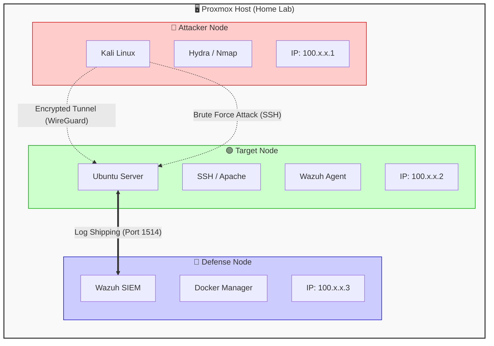

# Zero-Trust Network Implementation (Tailscale)

## Overview
Instead of relying on traditional fragile network bridges or port forwarding, this lab utilizes Tailscale to create a mesh network. This ensures that all nodes can communicate securely over an encrypted overlay network, regardless of their physical network location.

## Architecture Benefits
**Zero Trust:** No open ports on the public internet. All traffic is authenticated via user identity.
**Network Segmentation:** The lab environment (`100.x.x.x`) is completely isolated from the home LAN (`192.168.x.x`).
**Portability:** The entire lab can be moved to a different physical location (e.g., public Wi-Fi) without breaking connectivity.

## Configuration Steps

### 1. Installation (Linux/Debian)
The following script was executed on all Proxmox LXC/VM nodes (Kali, Ubuntu, Wazuh):

```bash
# Add Tailscale repository and install
curl -fsSL https://tailscale.com/install.sh | sh

# Authenticate the node
sudo tailscale up
```

## Network Verification

```bash
# From Attacker (Kali) -> Target (Ubuntu)
ping <TARGET_TAILSCALE_IP> -c 4

# From SIEM (Wazuh) -> Agent (Ubuntu)
/var/ossec/bin/agent_control -l
```

## Topology

